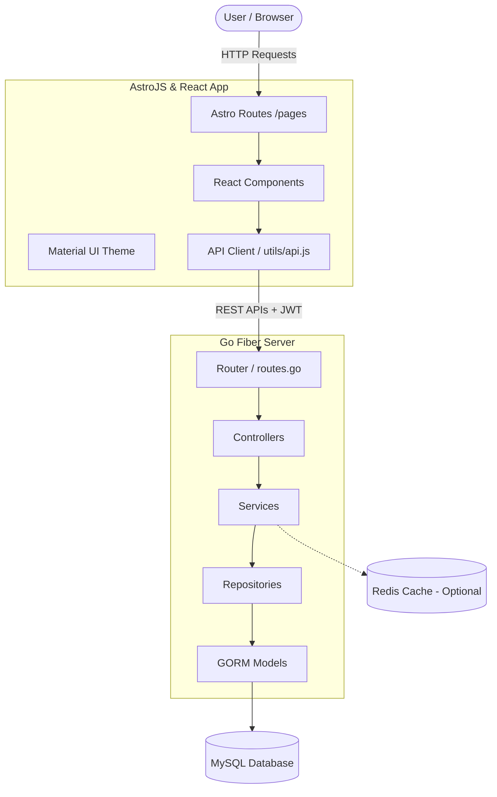
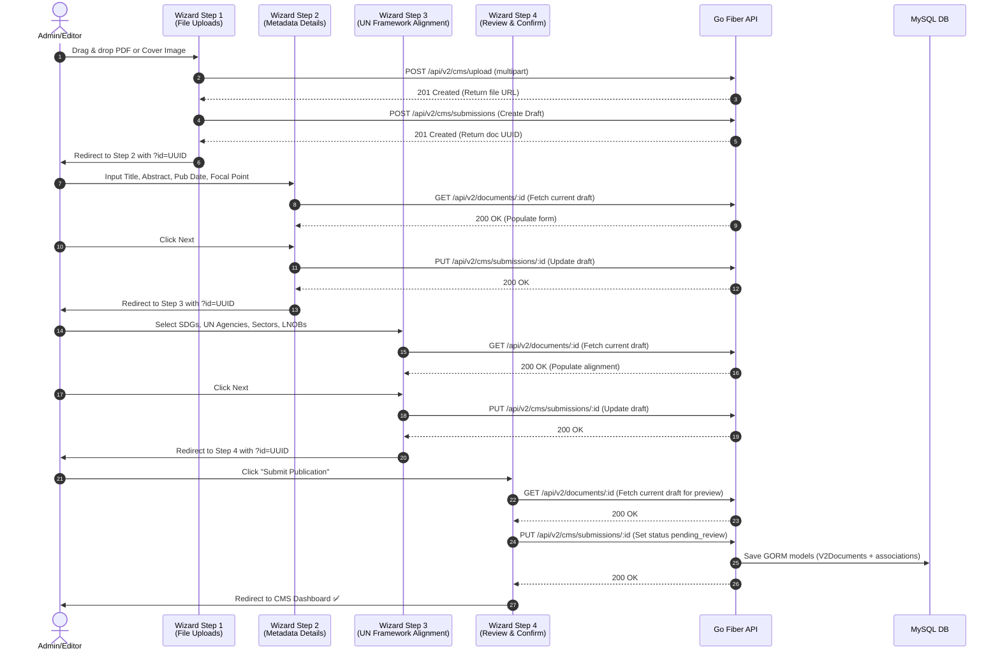

# 📚 Codebase Analysis Report: DOMES V2

**DOMES V2** (Document Management & Electronic System V2) is a comprehensive web application designed as the central document repository for the **United Nations in Indonesia**. It consists of a decoupled frontend (AstroJS & React) and backend (Go Fiber).

---

## 🏗️ System Architecture

DOMES V2 follows a decoupled client-server architecture:



---

## 💻 Frontend Application Details

* **Root Path:** [/home/ruangrimbun/MOREDATA/KERJA3/UNITEDNATIONS/DOMESV2](file:///home/ruangrimbun/MOREDATA/KERJA3/UNITEDNATIONS/DOMESV2)
* **Tech Stack:** AstroJS (`^6.4.4`), React (`^19.2.7`), Material UI (`^9.0.1`), Emotion, Recharts (`^3.8.1`), Vitest (`^4.1.10`).

### Folder Structure
* [`/src/pages`](file:///home/ruangrimbun/MOREDATA/KERJA3/UNITEDNATIONS/DOMESV2/src/pages): Automatic routing by Astro. Contains pages like:
  * `index.astro`: Entry point for the landing page.
  * `documents.astro` & `search-results.astro`: Document listing and filters.
  * `about.astro`, `faq.astro`, `analytics.astro`: Public pages.
  * `login.astro`, `register.astro`, `forgot-password.astro`: Auth management.
  * `cms/`: Pages dedicated to the back-office CMS, protected by authorization checks.
* [`/src/components`](file:///home/ruangrimbun/MOREDATA/KERJA3/UNITEDNATIONS/DOMESV2/src/components): Holds reusable UI components.
  * `MUIProvider.jsx`: Houses custom Material UI light mode palette, theme settings, and border radius rules.
  * `Navbar.jsx` / `Footer.jsx`: Shared navigation layouts.
  * `FilterSidebar.jsx` & `DocumentList.jsx`: Document filtering layout using HSL/light grey theme.
  * `cms/`: Components rendering CMS views, including:
    * `CMSNewSubmissionStep1.jsx` through `CMSNewSubmissionStep4.jsx` for the multi-step document wizard.
    * `CMSMasterReference.jsx`: Handles reference data management (SDGs, Agencies, etc.).
    * `CMSEditSubmission.jsx`: A 3-tab unified form for editing document details directly by parameter.
* [`/src/utils/api.js`](file:///home/ruangrimbun/MOREDATA/KERJA3/UNITEDNATIONS/DOMESV2/src/utils/api.js): Centralized HTTP client using standard `fetch`. Contains methods to communicate with the Go API, including authentication header injection (`Bearer <JWT>`), helper methods like `mapDocToPayload()`, and error parsing.

---

## ⚙️ Backend Application Details

* **Root Path:** [/MIXED/MOREDATA/KERJA3/UNITEDNATIONS/DOMESV2-GOFIBER](file:///MIXED/MOREDATA/KERJA3/UNITEDNATIONS/DOMESV2-GOFIBER)
* **Tech Stack:** Go Fiber (`v2`), GORM, MySQL (`8.0+`), Zap logger, Redis (optional), JWT.

### Backend Clean Architecture
The backend is structured into domain layers under [`/internal`](file:///MIXED/MOREDATA/KERJA3/UNITEDNATIONS/DOMESV2-GOFIBER/internal):
1. **Controller Layer:** Parses requests, extracts query params, and calls the appropriate service. Example: [`document_controller.go`](file:///MIXED/MOREDATA/KERJA3/UNITEDNATIONS/DOMESV2-GOFIBER/internal/controller/document_controller.go).
2. **Service Layer:** Houses the core business rules and business validations.
3. **Repository Layer:** Interacts with MySQL using GORM to query, filter, update, or join database tables.
4. **Model Layer:** Outlines structural blueprints for GORM representations and API payloads.
5. **Middleware Layer:** Protects resources using JWT authentication and handles global panic recoveries and structured JSON request logging.

---

## 🗄️ Database Models & Relationships

The database is built on **UUIDv4 string primary keys** under table names prefixed with `V2` (e.g., `V2Documents`). Here is a summary of the core GORM entity [`Document`](file:///MIXED/MOREDATA/KERJA3/UNITEDNATIONS/DOMESV2-GOFIBER/internal/model/document.go):

| Field | Type | Description |
|-------|------|-------------|
| `UUID` | string (size:36) | Unique identifier (primary key lookup) |
| `Title` / `Slug` | string | Document title and URL-friendly slug |
| `Abstract` / `Summary` | text | Brief overview and executive summary |
| `Language` | string | Language version (English, Indonesian, etc.) |
| `FileURL` / `FileSize` | string | Path to stored binary and file size metadata |
| `LeadAgencyCode` | string | References `V2Agencies` table |
| `JointProgrammeCode` | string | References `V2JointProgrammes` table |
| `Views` / `Downloads` | int | Tracked statistics updated via asynchronous logs |

### Relationships:
* **Many-to-Many Associations:**
  * `Sdgs` (`many2many:V2DocumentSdgs`): Tracks alignment with UN Sustainable Development Goals (e.g. Goal 1, Goal 17).
  * `Sectors` (`many2many:V2DocumentSectors`): Associated development sectors.
  * `Lnobs` (`many2many:V2DocumentLnobs`): Groups aligned with "Leave No One Behind" frameworks.

---

## 🔄 Core Functional Flow: New Submission Wizard

The UI uses a 4-step wizard to guide administrators and editors through the submission of new publication documents. Draft data is fetched and stored directly from/to the server via URL `id` parameter, completely removing client-side `sessionStorage` caching:



---

## ⚙️ How to Run & Work on the Projects

> [!TIP]
> Ensure Node.js (>=18) and Go (>=1.21) are installed before starting local servers.

### Running Backend (Go Fiber)
1. Navigate to `/MIXED/MOREDATA/KERJA3/UNITEDNATIONS/DOMESV2-GOFIBER`
2. Create/edit your `.env` configuration.
3. Install dependencies:
   ```bash
   go mod tidy
   ```
4. Run application:
   ```bash
   go run cmd/main.go
   ```
   *The backend will run on `http://localhost:3000`.*

### Running Frontend (Astro & React)
1. Navigate to `/home/ruangrimbun/MOREDATA/KERJA3/UNITEDNATIONS/DOMESV2`
2. Install dependencies:
   ```bash
   npm install
   ```
3. Run the development server:
   ```bash
   npm run dev
   ```
   *The frontend will run on `http://localhost:4321`.*
