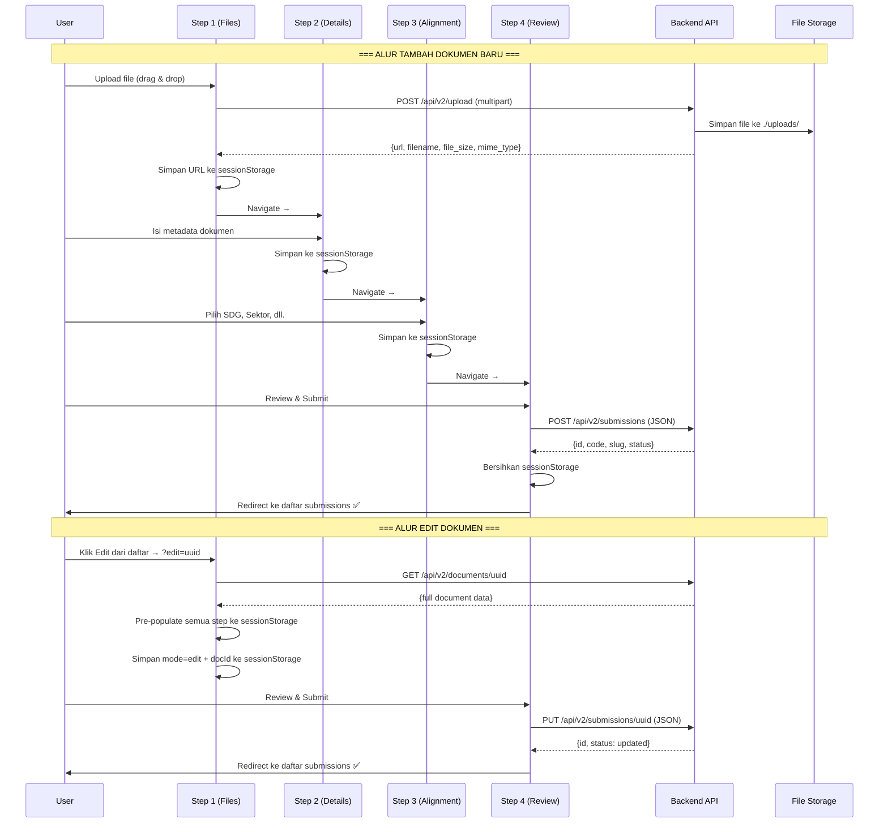

# 🔗 Rencana Implementasi: Koneksi Frontend Wizard ↔ Backend API

## Ringkasan Situasi

### ✅ Yang Sudah Ada
| Komponen | Status |
|----------|--------|
| Backend `POST /api/v2/submissions` (Create) | ✅ Ada, lengkap |
| Backend `POST /api/v2/submissions/:id/draft` (Save Draft) | ✅ Ada |
| Backend `POST /api/v2/upload` (File Upload) | ✅ Ada, maks 50MB |
| Backend `POST /api/v2/upload/url-validate` (Validasi URL) | ✅ Ada |
| Frontend API functions (`createSubmission`, `saveDraft`, dll.) | ✅ Ada di `api.js` |
| Auth flow (Login → JWT → localStorage) | ✅ Ada |
| Port alignment (Frontend `.env` → `localhost:3000` = Backend port) | ✅ Sesuai |

### ❌ Gap / Belum Terhubung
| Masalah | Dampak |
|---------|--------|
| **Step 1 tidak mengunggah file ke server** | File hanya di React state, hilang saat pindah halaman. Step 4 mengirim path fiktif (`/uploads/documents/filename.pdf`) |
| **Tidak ada endpoint UPDATE (`PUT /submissions/:id`)** | Dokumen yang sudah dibuat tidak bisa diedit kontennya |
| **Wizard tidak mendukung Edit Mode** | Tombol Edit di daftar submissions mengarah ke `?edit=id`, tapi wizard mengabaikan parameter ini |
| **`saveDraft()` tidak pernah dipanggil** | Draf hanya di `sessionStorage` browser, hilang jika browser ditutup |
| **Step 4 memiliki demo fallback** | Error API disamarkan — selalu redirect ke halaman sukses |
| **Tidak ada auth guard di halaman CMS** | Siapapun bisa akses `/cms/*` tanpa login |

---

## Arsitektur Alur Target

---

## Fase Implementasi

### Fase 1: Upload File di Step 1 → Server
> **Status**: ✅ Selesai
> **Prioritas**: 🔴 Kritis — tanpa ini, dokumen tidak punya file sungguhan

#### Backend — Tidak perlu perubahan
Endpoint `POST /api/v2/upload` sudah ada dan berfungsi:
- Menerima `multipart/form-data` dengan field `file`
- Menyimpan ke `./uploads/` dengan nama UUID
- Mengembalikan `{url, filename, original_name, file_size, mime_type}`

#### Frontend — Perubahan di `api.js`
Menambahkan helper `uploadFile(file)` dan `validateExternalUrl(url)` ke `src/utils/api.js` dengan bypass default application/json header untuk support raw `FormData` boundary.

#### Frontend — Perubahan di `CMSNewSubmissionStep1.jsx`
- Upload file PDF/Cover/Supporting file langsung ke server saat file dipilih.
- Tampilkan loading state "Uploading..." saat upload berlangsung.
- Simpan URL server yang dikembalikan ke dalam sessionStorage.
- Hubungkan tombol "Cek URL" dengan endpoint `validateExternalUrl` backend secara real.

---

### Fase 2: Perbaikan Step 4 — Koneksi Final yang Solid
> **Status**: ✅ Selesai
> **Prioritas**: 🔴 Kritis — memastikan submit benar-benar bekerja

- Menghapus path fiktif (`/uploads/documents/filename.pdf`). Payload menggunakan URL asli dari server yang disimpan dari Fase 1.
- Menghapus mock/offline fallback redirect success. Jika API error, tampilkan toast/alert pesan error.
- Redirect otomatis ke Step 1 jika sessionStorage kosong (menggantikan demo mock fallback).

---

### Fase 3: Backend — Tambah Endpoint Update Submission
> **Status**: ✅ Selesai
> **Prioritas**: 🔴 Kritis — tanpa ini, edit dokumen tidak bisa

#### Route baru
Menambahkan `PUT /api/v2/submissions/:id` pada protected routes group di `routes/routes.go`.

#### Controller & Service
- Menambahkan method `UpdateSubmission` pada controller layer.
- Menambahkan method `UpdateSubmission` pada service layer untuk fetch document by UUID, verify ownership (doc.AuthorID == userID atau user role == administrator), update fields, re-sync many-to-many associations (GORM `Replace`), dan update slug jika title berubah.

---

### Fase 4: Frontend — Edit Mode di Wizard
> **Status**: ✅ Selesai
> **Prioritas**: 🟠 Tinggi — melengkapi alur CRUD

- Di `CMSNewSubmissionStep1.jsx`, mendeteksi URL query param `?edit=uuid` pada `useEffect` mount.
- Memanggil GET `/api/v2/documents/:uuid` untuk load data.
- Memetakan data dari backend ke format sessionStorage untuk Step 1, 2, dan 3.
- Set flag `domes_submission_mode = { mode: "edit", docId: uuid }`.
- Di `CMSNewSubmissionStep4.jsx`, conditional call: jika edit mode panggil `updateSubmission(docId, payload)`, jika create mode panggil `createSubmission(payload)`.

---

### Fase 5: Auth Guard & Polish
> **Status**: ✅ Selesai
> **Prioritas**: 🟡 Sedang — keamanan & UX

- Mengamankan routing dashboard & submissions.
- Menambahkan loading spinners di UI saat request sedang berjalan.
- Hapus sessionStorage wizard dan mode flag setelah sukses submit/save draft.

---

## Urutan Pengerjaan & Estimasi

| # | Fase | Scope | Estimasi | Dependensi |
|---|------|-------|----------|------------|
| 1 | **Upload File (Step 1 → Server)** | Frontend: `api.js`, `Step1.jsx` | Sedang | — |
| 2 | **Backend Update Endpoint** | Backend: route, controller, service, repo | Sedang | — |
| 3 | **Edit Mode di Wizard** | Frontend: `Step1.jsx`, `Step4.jsx`, `api.js` | Besar | Fase 2 |
| 4 | **Perbaikan Step 4 Submit** | Frontend: `Step4.jsx` | Kecil | Fase 1 |
| 5 | **Auth Guard & Polish** | Frontend: `CMSLayout.jsx`, semua step | Kecil | — |

> [!IMPORTANT]
> **Fase 1 dan 2 bisa dikerjakan paralel** karena tidak saling bergantung.
> **Fase 3 membutuhkan Fase 2** (endpoint update harus ada dulu).
> **Fase 4 membutuhkan Fase 1** (file URL harus benar dulu).

---

## Daftar File yang Akan Diubah

### Frontend ([DOMESV2](file:///home/ruangrimbun/MOREDATA/KERJA3/UNITEDNATIONS/DOMESV2))
| File | Perubahan |
|------|-----------|
| [api.js](file:///home/ruangrimbun/MOREDATA/KERJA3/UNITEDNATIONS/DOMESV2/src/utils/api.js) | + `uploadFile()`, `validateExternalUrl()`, `updateSubmission()` |
| [CMSNewSubmissionStep1.jsx](file:///home/ruangrimbun/MOREDATA/KERJA3/UNITEDNATIONS/DOMESV2/src/components/cms/CMSNewSubmissionStep1.jsx) | Upload integrasi + Edit mode loader |
| [CMSNewSubmissionStep4.jsx](file:///home/ruangrimbun/MOREDATA/KERJA3/UNITEDNATIONS/DOMESV2/src/components/cms/CMSNewSubmissionStep4.jsx) | Conditional create/update + fix error handling |
| [CMSLayout.jsx](file:///home/ruangrimbun/MOREDATA/KERJA3/UNITEDNATIONS/DOMESV2/src/components/cms/CMSLayout.jsx) | Auth guard |

### Backend ([DOMESV2-GOFIBER](file:///MIXED/MOREDATA/KERJA3/UNITEDNATIONS/DOMESV2-GOFIBER))
| File | Perubahan |
|------|-----------|
| [routes.go](file:///MIXED/MOREDATA/KERJA3/UNITEDNATIONS/DOMESV2-GOFIBER/routes/routes.go) | + `PUT /submissions/:id` |
| [document_controller.go](file:///MIXED/MOREDATA/KERJA3/UNITEDNATIONS/DOMESV2-GOFIBER/internal/controller/document_controller.go) | + `UpdateSubmission()` |
| [document_service.go](file:///MIXED/MOREDATA/KERJA3/UNITEDNATIONS/DOMESV2-GOFIBER/internal/service/document_service.go) | + `UpdateSubmission()` |
| [document_repository.go](file:///MIXED/MOREDATA/KERJA3/UNITEDNATIONS/DOMESV2-GOFIBER/internal/repository/document_repository.go) | + `ClearDocumentRelations()` |
