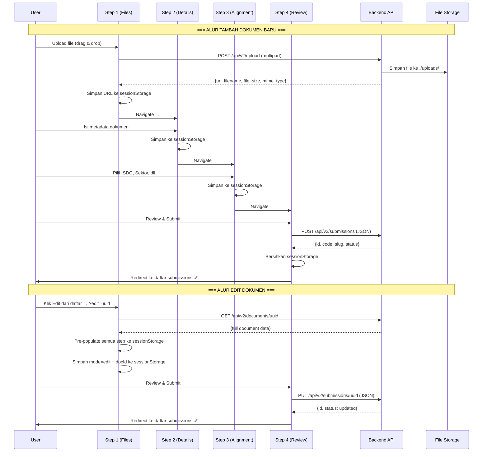

# 🔗 Rencana Implementasi: Koneksi Frontend Wizard ↔ Backend API

## Ringkasan Situasi

### ✅ Yang Sudah Ada
| Komponen | Status |
|----------|--------|
| Backend `POST /api/v2/submissions` (Create) | ✅ Ada, lengkap |
| Backend `POST /api/v2/submissions/:id/draft` (Save Draft) | ✅ Ada |
| Backend `POST /api/v2/upload` (File Upload) | ✅ Ada, maks 50MB |
| Backend `POST /api/v2/upload/url-validate` (Validasi URL) | ✅ Ada |
| Frontend API functions (`createSubmission`, `saveDraft`, dll.) | ✅ Ada di `api.js` |
| Auth flow (Login → JWT → localStorage) | ✅ Ada |
| Port alignment (Frontend `.env` → `localhost:3000` = Backend port) | ✅ Sesuai |

### ❌ Gap / Belum Terhubung
| Masalah | Dampak |
|---------|--------|
| **Step 1 tidak mengunggah file ke server** | File hanya di React state, hilang saat pindah halaman. Step 4 mengirim path fiktif (`/uploads/documents/filename.pdf`) |
| **Tidak ada endpoint UPDATE (`PUT /submissions/:id`)** | Dokumen yang sudah dibuat tidak bisa diedit kontennya |
| **Wizard tidak mendukung Edit Mode** | Tombol Edit di daftar submissions mengarah ke `?edit=id`, tapi wizard mengabaikan parameter ini |
| **`saveDraft()` tidak pernah dipanggil** | Draf hanya di `sessionStorage` browser, hilang jika browser ditutup |
| **Step 4 memiliki demo fallback** | Error API disamarkan — selalu redirect ke halaman sukses |
| **Tidak ada auth guard di halaman CMS** | Siapapun bisa akses `/cms/*` tanpa login |

---

## Arsitektur Alur Target



---

## Fase Implementasi

### Fase 1: Upload File di Step 1 → Server
> **Prioritas**: 🔴 Kritis — tanpa ini, dokumen tidak punya file sungguhan

#### Backend — Tidak perlu perubahan
Endpoint `POST /api/v2/upload` sudah ada dan berfungsi:
- Menerima `multipart/form-data` dengan field `file`
- Menyimpan ke `./uploads/` dengan nama UUID
- Mengembalikan `{url, filename, original_name, file_size, mime_type}`

#### Frontend — Perubahan di `api.js`
Tambahkan fungsi upload file baru:

```js
// api.js — fungsi baru
export async function uploadFile(file) {
  const token = getToken();
  const formData = new FormData();
  formData.append('file', file);

  const response = await fetch(`${API_BASE}/api/v2/upload`, {
    method: 'POST',
    headers: {
      ...(token && { 'Authorization': `Bearer ${token}` }),
      // JANGAN set Content-Type — browser akan set boundary otomatis
    },
    body: formData,
  });

  const result = await response.json();
  if (!response.ok) throw new Error(result.message || 'Upload failed');
  return result;
}

export async function validateExternalUrl(url) {
  return fetchAPI('/api/v2/upload/url-validate', {
    method: 'POST',
    body: JSON.stringify({ url }),
  });
}
```

#### Frontend — Perubahan di `CMSNewSubmissionStep1.jsx`

| Perubahan | Detail |
|-----------|--------|
| **Upload saat file di-drop/dipilih** | Panggil `uploadFile(file)` segera saat user memilih file. Tampilkan progress/loading indicator. |
| **Simpan URL hasil upload, bukan File object** | Ganti penyimpanan `primaryFile` (File object) menjadi objek `{name, size, url, mimeType}` yang berisi URL dari server |
| **Cover image upload** | Sama — upload langsung, simpan URL server |
| **Supporting files upload** | Setiap file pendukung di-upload saat ditambahkan |
| **Validasi URL eksternal** | Tombol "Cek URL" memanggil `validateExternalUrl()` beneran |
| **sessionStorage** | Sekarang menyimpan URL server (bukan metadata File kosong), data aman antar-navigasi |

**File yang diedit**:
- [api.js](file:///home/ruangrimbun/MOREDATA/KERJA3/UNITEDNATIONS/DOMESV2/src/utils/api.js) — tambah `uploadFile()`, `validateExternalUrl()`
- [CMSNewSubmissionStep1.jsx](file:///home/ruangrimbun/MOREDATA/KERJA3/UNITEDNATIONS/DOMESV2/src/components/cms/CMSNewSubmissionStep1.jsx) — integrasi upload

---

### Fase 2: Backend — Tambah Endpoint Update Submission
> **Prioritas**: 🔴 Kritis — tanpa ini, edit dokumen tidak bisa

#### Route baru
```go
// routes.go — tambahkan di group protected
protected.Put("/submissions/:id", docController.UpdateSubmission)
```

#### Controller
```go
// document_controller.go — method baru
func (ctrl *DocumentController) UpdateSubmission(c *fiber.Ctx) error {
    userID := c.Locals("user_id").(uint)
    idParam := c.Params("id")

    var req model.SubmissionRequest
    if err := c.BodyParser(&req); err != nil {
        return response.BadRequest(c, "Invalid request body", "INVALID_REQUEST_BODY")
    }

    doc, err := ctrl.docService.UpdateSubmission(userID, idParam, &req)
    if err != nil {
        return response.Error(c, err)
    }

    return response.Success(c, fiber.Map{
        "id":     doc.UUID,
        "code":   doc.Code,
        "slug":   doc.Slug,
        "title":  doc.Title,
        "status": doc.Status,
    }, "Submission updated successfully")
}
```

#### Service
```go
// document_service.go — method baru
func (s *documentService) UpdateSubmission(userID uint, docID string, req *model.SubmissionRequest) (*model.Document, error) {
    // 1. Fetch existing document by UUID
    // 2. Verify ownership (authorID == userID) atau admin
    // 3. Update semua field dari SubmissionRequest
    // 4. Re-sync many2many relations (SDGs, Sectors, LNOBs)
    //    - Hapus relasi lama
    //    - Buat relasi baru
    // 5. Update slug jika title berubah
    // 6. Save
}
```

#### Repository
```go
// document_repository.go — method baru
func (r *documentRepository) ClearDocumentRelations(docID uint) error {
    // DELETE FROM v2_document_sdgs WHERE document_id = ?
    // DELETE FROM v2_document_sectors WHERE document_id = ?
    // DELETE FROM v2_document_lnobs WHERE document_id = ?
}
```

**File yang diedit**:
- [routes.go](file:///MIXED/MOREDATA/KERJA3/UNITEDNATIONS/DOMESV2-GOFIBER/routes/routes.go) — tambah route
- [document_controller.go](file:///MIXED/MOREDATA/KERJA3/UNITEDNATIONS/DOMESV2-GOFIBER/internal/controller/document_controller.go) — tambah handler
- [document_service.go](file:///MIXED/MOREDATA/KERJA3/UNITEDNATIONS/DOMESV2-GOFIBER/internal/service/document_service.go) — tambah logic
- [document_repository.go](file:///MIXED/MOREDATA/KERJA3/UNITEDNATIONS/DOMESV2-GOFIBER/internal/repository/document_repository.go) — tambah helper

**File frontend**:
- [api.js](file:///home/ruangrimbun/MOREDATA/KERJA3/UNITEDNATIONS/DOMESV2/src/utils/api.js) — tambah `updateSubmission(id, payload)`

---

### Fase 3: Frontend — Edit Mode di Wizard
> **Prioritas**: 🟠 Tinggi — melengkapi alur CRUD

#### Mekanisme Edit Mode

Saat ini tombol Edit di [CMSSubmissions.jsx](file:///home/ruangrimbun/MOREDATA/KERJA3/UNITEDNATIONS/DOMESV2/src/components/cms/CMSSubmissions.jsx) sudah mengarah ke:
```js
window.location.href = `/cms/submissions/new/step-1?edit=${row.id}`
```

Yang perlu dibangun:

#### Step 1 — Deteksi & Load Data Edit

```
1. Baca URL query param `?edit=<uuid>`
2. Jika ada → panggil GET /api/v2/documents/<uuid>
3. Map response ke format sessionStorage semua step:
   - domes_submission_step1: {primaryFileName, fileUrl, coverUrl, supportingFiles, ...}
   - domes_submission_step2: {title, pubDate, summary, shortSummary, tags, ...}
   - domes_submission_step3: {selectedSDGs, selectedSectors, selectedAgencies, ...}
4. Simpan flag edit mode: sessionStorage.setItem('domes_submission_mode', JSON.stringify({mode:'edit', docId: uuid}))
5. Pre-populate Step 1 UI dengan data yang sudah ada
```

#### Step 2, 3 — Tidak perlu perubahan besar
- Sudah membaca dari sessionStorage saat `useEffect` mount
- Data akan otomatis ter-populate dari langkah sebelumnya

#### Step 4 — Conditional Create vs Update

```js
// CMSNewSubmissionStep4.jsx — handleFinishSubmit
const modeData = JSON.parse(sessionStorage.getItem('domes_submission_mode') || '{}');

if (modeData.mode === 'edit' && modeData.docId) {
  // EDIT MODE → PUT
  const res = await updateSubmission(modeData.docId, payload);
} else {
  // CREATE MODE → POST
  const res = await createSubmission(payload);
}
```

**File yang diedit**:
- [CMSNewSubmissionStep1.jsx](file:///home/ruangrimbun/MOREDATA/KERJA3/UNITEDNATIONS/DOMESV2/src/components/cms/CMSNewSubmissionStep1.jsx) — load data edit
- [CMSNewSubmissionStep4.jsx](file:///home/ruangrimbun/MOREDATA/KERJA3/UNITEDNATIONS/DOMESV2/src/components/cms/CMSNewSubmissionStep4.jsx) — conditional create/update
- [api.js](file:///home/ruangrimbun/MOREDATA/KERJA3/UNITEDNATIONS/DOMESV2/src/utils/api.js) — tambah `updateSubmission()`

---

### Fase 4: Perbaikan Step 4 — Koneksi Final yang Solid
> **Prioritas**: 🟠 Tinggi — memastikan submit benar-benar bekerja

#### Perbaikan yang diperlukan

| Item | Sebelum | Sesudah |
|------|---------|---------|
| **File URL** | Path fiktif `/uploads/documents/filename.pdf` | URL asli dari server (dari Fase 1) |
| **Demo fallback** | `catch → redirect sukses` | Tampilkan error toast/message, jangan redirect |
| **Field mapping** | Beberapa field mungkin tidak sinkron | Audit & pastikan semua field di `SubmissionRequest` terisi benar |
| **Loading state** | Ada tapi sederhana | Tambah disable semua navigasi saat loading |

#### Audit Field Mapping (Frontend Payload → Backend SubmissionRequest)

| Frontend (Step 4 payload) | Backend (`SubmissionRequest`) | Status |
|---------------------------|-------------------------------|--------|
| `title` | `Title` | ✅ Cocok |
| `short_description` | `ShortDescription` | ✅ Cocok |
| `abstract` | `Abstract` | ⚠️ Saat ini diisi sama dengan `short_description` — nanti perlu dipisah jika beda |
| `detailed_summary` | `DetailedSummary` | ✅ Cocok |
| `date_of_publication` | `DateOfPublication` | ✅ Cocok |
| `total_pages` | `TotalPages` | ✅ Cocok |
| `language` | `Language` | ✅ Cocok |
| `publication_status` | `PublicationStatus` | ✅ Cocok |
| `tags` | `Tags` | ✅ Cocok (array) |
| `file_url` | `FileURL` | ⚠️ Saat ini fiktif — akan benar setelah Fase 1 |
| `file_size` | `FileSize` | ✅ Cocok |
| `cover_image_url` | `CoverImageURL` | ⚠️ Saat ini hardcoded ke `/images/report_cover.png` — akan benar setelah Fase 1 |
| `external_url` | `ExternalURL` | ✅ Cocok |
| `supporting_files` | `SupportingFiles` | ⚠️ URL fiktif — akan benar setelah Fase 1 |
| `agency` | `Agency` | ✅ Cocok |
| `focal_point` | `FocalPoint` | ✅ Cocok (nested object) |
| `sdgs` | `Sdgs` | ⚠️ Frontend kirim `["GOAL 1", "GOAL 5"]`, backend expects codes — perlu audit |
| `sectors` | `Sectors` | ⚠️ Frontend kirim nama lengkap `["Economic Development"]`, backend expects codes — perlu audit |
| `lnob_groups` | `LnobGroups` | ⚠️ Sama — nama vs code |
| `joint_programme` | `JointProgramme` | ✅ Cocok (string) |
| `other_agencies` | `OtherAgencies` | ✅ Cocok (array) |
| `non_un_partners` | `NonUnPartners` | ✅ Cocok (array of {type, name}) |
| `thematic_areas` | `ThematicAreas` | ✅ Cocok (array) |
| `geographic_scope` | `GeographicScope` | ✅ Cocok (hardcoded) |
| `is_active` | `IsActive` | ✅ Cocok (boolean pointer) |

> [!WARNING]
> **SDGs, Sectors, dan LNOBs** — frontend mengirim nama/label (`"Economic Development"`), tapi backend menyimpan ke tabel relasi many2many yang menggunakan **Code**. Perlu dicek apakah service layer sudah melakukan lookup by name → code, atau apakah frontend perlu mengirim code langsung. Ini adalah potensi bug mapping paling besar.

**File yang diedit**:
- [CMSNewSubmissionStep4.jsx](file:///home/ruangrimbun/MOREDATA/KERJA3/UNITEDNATIONS/DOMESV2/src/components/cms/CMSNewSubmissionStep4.jsx) — perbaikan payload & error handling

---

### Fase 5: Auth Guard & Polish
> **Prioritas**: 🟡 Sedang — keamanan & UX

#### Auth Guard di CMS Layout
```jsx
// CMSLayout.jsx — tambahkan pengecekan token
useEffect(() => {
  const token = getToken();
  if (!token) {
    window.location.href = '/login';
  }
}, []);
```

#### Perbaikan UX Lainnya
- [ ] Tambah toast/notification untuk error API (bukan alert)
- [ ] Tambah konfirmasi "Apakah Anda yakin ingin meninggalkan halaman?" jika ada data belum disimpan
- [ ] Tambah loading skeleton saat memuat data edit
- [ ] Bersihkan `sessionStorage` wizard saat user keluar dari CMS atau logout
- [ ] Tambah validasi required fields sebelum navigasi ke step berikutnya

---

## Urutan Pengerjaan & Estimasi

| # | Fase | Scope | Estimasi | Dependensi |
|---|------|-------|----------|------------|
| 1 | **Upload File (Step 1 → Server)** | Frontend: `api.js`, `Step1.jsx` | Sedang | — |
| 2 | **Backend Update Endpoint** | Backend: route, controller, service, repo | Sedang | — |
| 3 | **Edit Mode di Wizard** | Frontend: `Step1.jsx`, `Step4.jsx`, `api.js` | Besar | Fase 2 |
| 4 | **Perbaikan Step 4 Submit** | Frontend: `Step4.jsx` | Kecil | Fase 1 |
| 5 | **Auth Guard & Polish** | Frontend: `CMSLayout.jsx`, semua step | Kecil | — |

> [!IMPORTANT]
> **Fase 1 dan 2 bisa dikerjakan paralel** karena tidak saling bergantung.
> **Fase 3 membutuhkan Fase 2** (endpoint update harus ada dulu).
> **Fase 4 membutuhkan Fase 1** (file URL harus benar dulu).

---

## Daftar File yang Akan Diubah

### Frontend ([DOMESV2](file:///home/ruangrimbun/MOREDATA/KERJA3/UNITEDNATIONS/DOMESV2))
| File | Perubahan |
|------|-----------|
| [api.js](file:///home/ruangrimbun/MOREDATA/KERJA3/UNITEDNATIONS/DOMESV2/src/utils/api.js) | + `uploadFile()`, `validateExternalUrl()`, `updateSubmission()` |
| [CMSNewSubmissionStep1.jsx](file:///home/ruangrimbun/MOREDATA/KERJA3/UNITEDNATIONS/DOMESV2/src/components/cms/CMSNewSubmissionStep1.jsx) | Upload integrasi + Edit mode loader |
| [CMSNewSubmissionStep4.jsx](file:///home/ruangrimbun/MOREDATA/KERJA3/UNITEDNATIONS/DOMESV2/src/components/cms/CMSNewSubmissionStep4.jsx) | Conditional create/update + fix error handling |
| [CMSLayout.jsx](file:///home/ruangrimbun/MOREDATA/KERJA3/UNITEDNATIONS/DOMESV2/src/components/cms/CMSLayout.jsx) | Auth guard |

### Backend ([DOMESV2-GOFIBER](file:///MIXED/MOREDATA/KERJA3/UNITEDNATIONS/DOMESV2-GOFIBER))
| File | Perubahan |
|------|-----------|
| [routes.go](file:///MIXED/MOREDATA/KERJA3/UNITEDNATIONS/DOMESV2-GOFIBER/routes/routes.go) | + `PUT /submissions/:id` |
| [document_controller.go](file:///MIXED/MOREDATA/KERJA3/UNITEDNATIONS/DOMESV2-GOFIBER/internal/controller/document_controller.go) | + `UpdateSubmission()` |
| [document_service.go](file:///MIXED/MOREDATA/KERJA3/UNITEDNATIONS/DOMESV2-GOFIBER/internal/service/document_service.go) | + `UpdateSubmission()` |
| [document_repository.go](file:///MIXED/MOREDATA/KERJA3/UNITEDNATIONS/DOMESV2-GOFIBER/internal/repository/document_repository.go) | + `ClearDocumentRelations()` |
