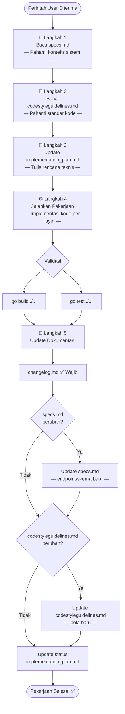

# 🤖 Workflow Agen AI — Backend DOMES V2

Dokumen ini mendefinisikan **alur kerja wajib** yang harus diikuti oleh agen AI (seperti Antigravity, Copilot, Cursor, atau asisten coding lainnya) setiap kali menerima perintah untuk mengerjakan perubahan pada codebase **Backend DOMES V2** (Go Fiber).

> [!IMPORTANT]
> Semua langkah di bawah ini bersifat **sekuensial dan wajib**. Tidak boleh ada langkah yang dilewati.

---

## Langkah 1: Baca Spesifikasi Sistem (`specs.md`)

**File**: [`docs/specs.md`](file:///MIXED/MOREDATA/KERJA3/UNITEDNATIONS/DOMESV2-GOFIBER/docs/specs.md)

### Tujuan
Memahami konteks lengkap sistem sebelum memulai pekerjaan apapun:
- Technology stack yang digunakan (Go 1.21, GoFiber v2, MySQL+GORM, Redis, Zap Logger, JWT, Bcrypt, reCAPTCHA)
- Arsitektur berlapis (Controller → Service → Repository → Model)
- Skema database V2 (UUID primary key, V2 prefix, soft delete, audit fields)
- Daftar endpoint API (Public, Auth, Protected CMS)
- Relasi Many-to-Many (SDGs, Sectors, LNOBs, Agencies)

### Yang Harus Diperhatikan
- Apakah perintah user menyangkut layer tertentu (Controller/Service/Repository)?
- Apakah pekerjaan melibatkan endpoint baru atau modifikasi endpoint yang sudah ada?
- Apakah ada perubahan skema database yang diperlukan?
- Apakah endpoint baru perlu dilindungi JWT middleware (route protected)?

### Aksi
```
✅ Baca file specs.md secara keseluruhan
✅ Identifikasi bagian specs yang relevan dengan perintah user
✅ Catat layer, file, dan endpoint yang kemungkinan terdampak
```

---

## Langkah 2: Baca Panduan Gaya Kode (`codestyleguidelines.md`)

**File**: [`docs/codestyleguidelines.md`](file:///MIXED/MOREDATA/KERJA3/UNITEDNATIONS/DOMESV2-GOFIBER/docs/codestyleguidelines.md)

### Tujuan
Memastikan setiap baris kode yang ditulis atau diubah **konsisten** dengan standar yang telah ditetapkan:
- **Go Coding Style**: `gofmt`/`goimports`, max 120 karakter per baris, `PascalCase` untuk export, `camelCase` untuk lokal, `snake_case.go` untuk nama file, akronim huruf besar (`APIURL`, `DocumentUUID`)
- **Layered Architecture Rules**:
  - Controller: HANYA parsing HTTP + memanggil service + return response. **DILARANG** query DB langsung.
  - Service: Logika bisnis utama. **DILARANG** menerima `*fiber.Ctx`.
  - Repository: HANYA query GORM ke database.
- **Logging**: Gunakan Zap Logger (`zap.L()`). **DILARANG** `fmt.Println()`, `print()`, `log.Println()`.
- **Error Handling**: Error bubble up ke Controller → centralized error handler. Gunakan `pkg/errors` untuk tipe error. Response JSON standard dari `pkg/response`.
- **Database**: Parameterized queries, auto-migration di `cmd/main.go`, nama tabel `V2`-prefix, test isolation.

### Yang Harus Diperhatikan
- Jangan pernah melewatkan `*fiber.Ctx` ke Service layer — konteks HTTP hanya di Controller.
- Jangan pernah query database langsung dari Controller — delegasikan ke Service → Repository.
- Jangan gunakan `fmt.Println` untuk logging — selalu Zap Logger.
- Pastikan semua response menggunakan format standard dari `pkg/response`.

### Aksi
```
✅ Baca file codestyleguidelines.md secara keseluruhan
✅ Internalisasi semua aturan sebelum menulis kode
✅ Gunakan sebagai checklist validasi setelah menulis kode
```

---

## Langkah 3: Update Rencana Implementasi (`implementation_plan.md`)

**File**: [`docs/implementation_plan.md`](file:///MIXED/MOREDATA/KERJA3/UNITEDNATIONS/DOMESV2-GOFIBER/docs/implementation_plan.md)

### Tujuan
Menyelaraskan rencana implementasi dengan perintah yang sedang dijalankan. File ini adalah **dokumen hidup** yang harus di-update sebelum memulai coding.

### Aksi Sebelum Coding

1. **Baca** `implementation_plan.md` secara keseluruhan.
2. **Cocokkan** perintah user dengan fase/task yang sudah ada:
   - Jika perintah user sesuai dengan fase yang sudah ada → tandai fase tersebut sebagai **🔄 Sedang Dikerjakan**.
   - Jika perintah user adalah tugas baru yang belum tercakup → **tambahkan fase/section baru** ke dalam implementation plan.
3. **Tulis rencana teknis** yang mencakup:
   - Layer yang terdampak (Controller/Service/Repository/Model)
   - File-file yang akan diubah/dibuat
   - Perubahan spesifik pada setiap file
   - Endpoint baru (method, path, middleware)
   - Perubahan skema database (jika ada)
   - Dependensi antar perubahan

### Format Update

Tambahkan atau perbarui section di `implementation_plan.md` dengan format:

```markdown
### Fase X: [Nama Tugas]
> **Status**: 🔄 Sedang Dikerjakan | ✅ Selesai | ⏸️ Ditunda
> **Perintah**: [Ringkasan perintah user yang memicu task ini]
> **Tanggal**: [YYYY-MM-DD]

#### Rencana Perubahan
| Layer | File | Perubahan |
|-------|------|-----------|
| Route | `routes/routes.go` | Deskripsi perubahan |
| Controller | `internal/controller/xxx.go` | Deskripsi perubahan |
| Service | `internal/service/xxx.go` | Deskripsi perubahan |
| Repository | `internal/repository/xxx.go` | Deskripsi perubahan |
| Model | `internal/model/xxx.go` | Deskripsi perubahan |

#### Catatan Teknis
- [Catatan penting tentang implementasi]
```

### Aksi
```
✅ Baca implementation_plan.md
✅ Update status fase yang relevan
✅ Tambahkan fase baru jika diperlukan
✅ Tulis rencana teknis detail per layer
✅ Simpan perubahan ke file
```

---

## Langkah 4: Jalankan Pekerjaan

### Tujuan
Eksekusi perubahan kode sesuai rencana yang sudah ditulis di Langkah 3, dengan mematuhi semua aturan dari Langkah 1 (specs) dan Langkah 2 (code style).

### Prinsip Eksekusi

1. **Ikuti arsitektur berlapis** — Tulis kode di layer yang benar:
   - **Route** → Daftarkan endpoint baru di `routes/routes.go` dengan middleware yang sesuai.
   - **Controller** → Parse request, panggil service, format response.
   - **Service** → Logika bisnis, transaksi, koordinasi repository.
   - **Repository** → Query GORM ke database.
   - **Model** → Struct definisi tabel dan request/response types.
2. **Ikuti rencana** — Kerjakan sesuai urutan yang sudah ditulis di `implementation_plan.md`.
3. **Satu perubahan, satu tujuan** — Jangan mencampur perbaikan yang tidak terkait.
4. **Test setelah perubahan** — Jalankan `go build ./...` untuk validasi kompilasi dan `go test ./...` jika ada unit test.
5. **Jangan hapus komentar/docstring yang tidak terkait** — Pertahankan dokumentasi yang sudah ada.

### Checklist Kualitas Kode

Sebelum menyelesaikan pekerjaan, verifikasi:

- [ ] Controller TIDAK query database secara langsung
- [ ] Service TIDAK menerima `*fiber.Ctx`
- [ ] Semua logging menggunakan Zap Logger (`zap.L()`)
- [ ] TIDAK ada `fmt.Println()`, `print()`, atau `log.Println()` di production code
- [ ] Semua response menggunakan `pkg/response` (format standard JSON)
- [ ] Error di-handle dengan `pkg/errors` dan bubble up ke Controller
- [ ] Query database menggunakan parameterized queries (anti SQL injection)
- [ ] Nama tabel baru menggunakan prefix `V2` dan bentuk jamak
- [ ] Primary key menggunakan UUID v4 string
- [ ] Tabel baru didaftarkan di AutoMigrate
- [ ] Nama file menggunakan `snake_case.go`
- [ ] Identifier export menggunakan `PascalCase`, lokal menggunakan `camelCase`
- [ ] Akronim ditulis huruf besar seluruhnya (`UUID`, `API`, `URL`)
- [ ] Endpoint protected dilindungi JWT middleware

### Aksi
```
✅ Implementasikan perubahan sesuai rencana per layer
✅ Validasi kode terhadap checklist kualitas
✅ Jalankan go build ./... untuk verifikasi kompilasi
✅ Test jika memungkinkan
```

---

## Langkah 5: Update Dokumentasi

### Tujuan
Memperbarui semua dokumen yang terdampak oleh perubahan yang baru saja dilakukan. Langkah ini **wajib** dilakukan setiap kali ada perubahan kode.

### 5a. Update Changelog (`changelog.md`)

**File**: [`docs/changelog.md`](file:///MIXED/MOREDATA/KERJA3/UNITEDNATIONS/DOMESV2-GOFIBER/docs/changelog.md)

Tambahkan entri baru di bagian **paling atas** changelog (di bawah header). Ikuti format [Keep a Changelog](https://keepachangelog.com/):

```markdown
## [X.Y.Z] - YYYY-MM-DD

### Added
- **Nama Fitur**: Deskripsi singkat fitur baru yang ditambahkan.

### Changed
- **Nama Perubahan**: Deskripsi singkat perubahan pada fitur yang sudah ada.

### Fixed
- **Nama Perbaikan**: Deskripsi singkat bug yang diperbaiki.

### Removed
- **Nama Penghapusan**: Deskripsi singkat fitur atau kode yang dihapus.
```

**Aturan versioning**:
- **Patch** (`X.Y.+1`): Bug fix kecil, perbaikan query, perubahan minor
- **Minor** (`X.+1.0`): Endpoint baru, fitur baru, perubahan non-breaking
- **Major** (`+1.0.0`): Perubahan breaking API, redesain skema database besar

### 5b. Update Specs (`specs.md`) — Jika Diperlukan

**File**: [`docs/specs.md`](file:///MIXED/MOREDATA/KERJA3/UNITEDNATIONS/DOMESV2-GOFIBER/docs/specs.md)

Update `specs.md` jika perubahan menyebabkan:
- Penambahan endpoint API baru
- Perubahan skema database (tabel/kolom baru)
- Perubahan arsitektur atau technology stack
- Perubahan pola middleware atau authentication

### 5c. Update Code Style Guidelines (`codestyleguidelines.md`) — Jika Diperlukan

**File**: [`docs/codestyleguidelines.md`](file:///MIXED/MOREDATA/KERJA3/UNITEDNATIONS/DOMESV2-GOFIBER/docs/codestyleguidelines.md)

Update `codestyleguidelines.md` jika perubahan menyebabkan:
- Pengenalan pola coding baru yang harus diikuti
- Perubahan konvensi arsitektur atau layer
- Penambahan library/tool baru yang membutuhkan panduan penggunaan
- Perubahan standar error handling, logging, atau response format

### 5d. Update Implementation Plan (`implementation_plan.md`)

**File**: [`docs/implementation_plan.md`](file:///MIXED/MOREDATA/KERJA3/UNITEDNATIONS/DOMESV2-GOFIBER/docs/implementation_plan.md)

Tandai fase yang baru selesai dikerjakan:
- Ubah status dari `🔄 Sedang Dikerjakan` menjadi `✅ Selesai`
- Tambahkan catatan hasil implementasi jika ada penyimpangan dari rencana awal

### Aksi
```
✅ Tambahkan entri changelog baru
✅ Update specs.md jika ada perubahan endpoint/skema/arsitektur
✅ Update codestyleguidelines.md jika ada pola baru
✅ Update status di implementation_plan.md
```

---

## 📋 Ringkasan Alur (Quick Reference)



---

## 🏗️ Referensi Arsitektur Layer

Untuk memudahkan navigasi, berikut mapping layer ke folder/file:

```
DOMESV2-GOFIBER/
├── cmd/main.go                        # Entrypoint: init DB, Logger, Redis, Seeders, Server
├── routes/routes.go                   # Definisi semua endpoint HTTP + middleware
├── internal/
│   ├── controller/                    # HTTP handler (parse request, format response)
│   │   ├── auth_controller.go
│   │   ├── document_controller.go
│   │   └── master_controller.go
│   ├── service/                       # Logika bisnis (transaksi, koordinasi)
│   │   ├── auth_service.go
│   │   ├── document_service.go
│   │   └── master_service.go
│   ├── repository/                    # Query database (GORM)
│   │   ├── auth_repository.go
│   │   ├── document_repository.go
│   │   └── master_repository.go
│   ├── model/                         # Struct definisi tabel & request/response
│   │   ├── document.go
│   │   ├── user.go
│   │   └── master.go
│   └── middleware/                     # Middleware (JWT, error handler, CORS)
├── pkg/                               # Shared utilities
│   ├── errors/                        # Tipe error custom
│   ├── response/                      # Standard JSON response helpers
│   ├── logger/                        # Zap Logger setup
│   └── captcha/                       # reCAPTCHA validator
├── config/                            # Konfigurasi environment
└── database/                          # Koneksi DB & seeders
```

---

## ⚠️ Aturan Penting

1. **Jangan langsung coding** — Selalu baca specs dan code style terlebih dahulu.
2. **Jangan ubah kode tanpa rencana** — Update `implementation_plan.md` dulu.
3. **Jangan lupa dokumentasi** — Changelog wajib di-update setiap ada perubahan.
4. **Patuhi layer boundary** — Controller tidak boleh akses DB, Service tidak boleh akses HTTP context.
5. **Konteks frontend** — Jika pekerjaan melibatkan integrasi dengan frontend, baca juga dokumentasi frontend di [`DOMESV2/docs/`](file:///home/ruangrimbun/MOREDATA/KERJA3/UNITEDNATIONS/DOMESV2/docs/).
6. **Tanyakan jika ambigu** — Jika perintah user tidak jelas, minta klarifikasi sebelum mulai.
7. **Dokumentasi tambahan** — Referensi arsitektur lebih detail tersedia di folder [`docsagent/`](file:///MIXED/MOREDATA/KERJA3/UNITEDNATIONS/DOMESV2-GOFIBER/docsagent/) (overview, architecture, API reference, database, configuration, development, deployment, error handling, security).
